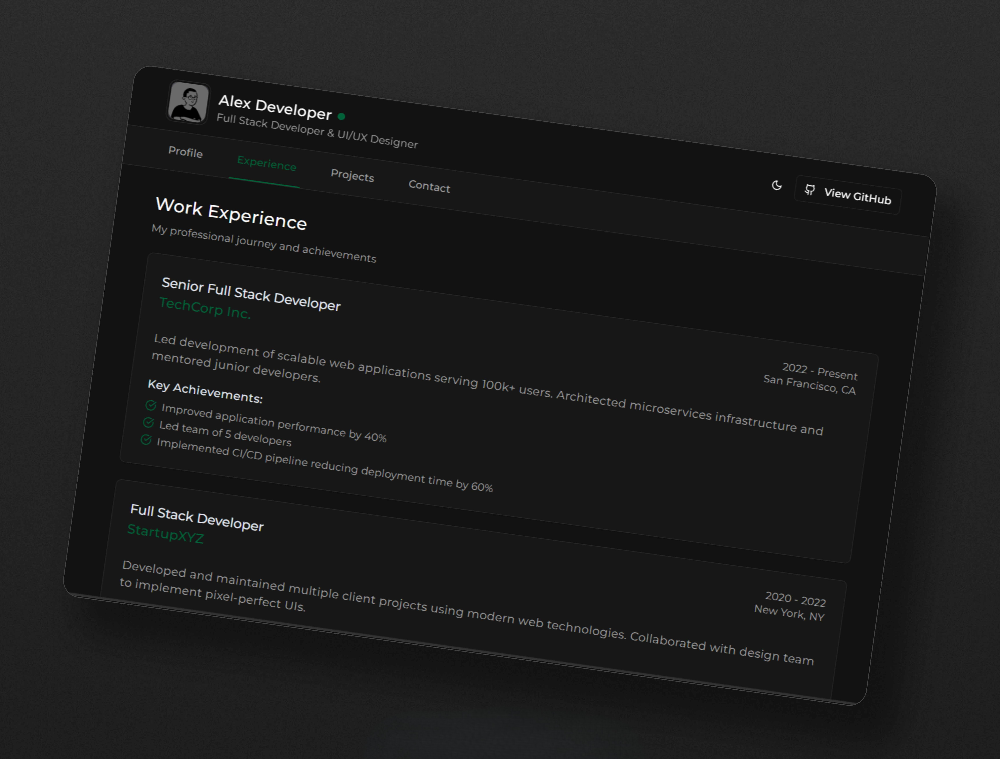

# 👋 Minimal Portfolio 

A sleek and minimal portfolio website built with **Next.js**, showcasing professional experience and projects in a clean, user-friendly design. 💯

## 📸 Demo Screenshot



<div align="center">
   <a href="https://minimal-portfolio-ps.vercel.app"><strong>➥ Live Demo</strong></a>
</div>

---

## 🚀 Getting Started

Follow the steps below to run the project locally:

### ✅ Prerequisites

Ensure you have the following installed:

* [Node.js](https://nodejs.org/) (v18 or later)
* [pnpm](https://pnpm.io/) (recommended) or [npm](https://www.npmjs.com/)

---

### 📦 Installation

1. **Clone the repository:**

   ```bash
   git clone https://github.com/psparwez/minimal-portfolio.git
   cd minimal-portfolio
   ```

2. **Install dependencies:**

   ```bash
   pnpm install
   # or
   npm install
   ```

3. **Set up environment variables:**

   Create a `.env.local` file in the root directory and add the following:

   ```env
   SMTP_USERNAME=your_smtp_username
   SMTP_PASSWORD=your_smtp_password
   MAIL_RECEIVER_ADDRESS=your_email@example.com
   ```

4. **Start the development server:**

   ```bash
   pnpm dev
   # or
   npm run dev
   ```

   Open [http://localhost:3000](http://localhost:3000) in your browser to see the app.

---

### 📦 Build for Production

To create an optimized build for production:

```bash
pnpm build
pnpm start
# or
npm run build
npm start
```

---

---
### Reporting Issues

If you encounter any bugs or have suggestions, please open an issue on the [GitHub Issues page](https://github.com/psparwez/minimal-portfolio/issues).

I look forward to hearing from you and collaborating!
<br />

<br><hr>
[🔼 Back to top](#)
